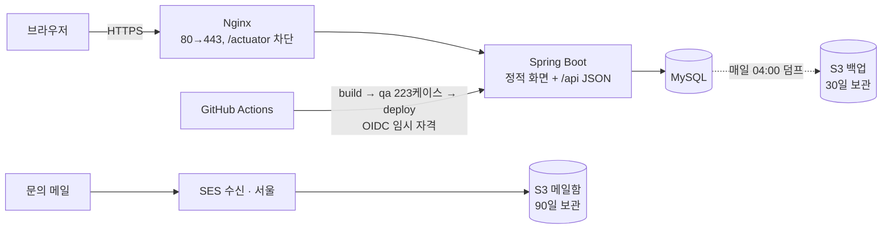

# 도토리 (dotoree) 🌰

**AI 영수증 인식 · 지도 기반 개인 · 공동 가계부** — 24시간 운영하는 실서비스를 목표로 혼자 기획·설계·개발·배포·운영하고 있습니다.

🔗 **https://dotoree.app** (가입해서 바로 써 볼 수 있습니다)

> 지금은 **Sprint 1(개인 가계부 + 인증 + 배포·운영)** 단계입니다. 영수증·결제내역 캡처 AI 분석(Sprint 2~3), 공동 가계부·정산(Sprint 4), 지도·PWA(Sprint 5)는 설계를 마치고 순서대로 만들고 있습니다.

---

## 지금 동작하는 것

| 영역 | 내용 |
|---|---|
| 회원 · 인증 | 가입 · 로그인(JWT Access 15분) · **Refresh 토큰 로테이션 + 재사용 탐지 + 유예 30초** · 로그아웃 · 비밀번호 변경 시 전 세션 폐기 · 탈퇴(30일 유예 후 물리 삭제) |
| 개인 가계부 | 수입·지출 CRUD, 월 단위 조회, 낙관적 락으로 동시 수정 충돌 409 |
| 카테고리 | 대분류-소분류 2단계, 이모지, 예약어 '미분류', 삭제 시 거래를 같은 타입 미분류로 이관 |
| 통계 | 월별 수입·지출·잔액, 카테고리 봉투(대분류 안에 소분류, 비율은 부모 대비), 수입 0원이면 '계산 불가' |
| 화면 | Vanilla JS 정적 페이지, 다크 모드, Access 만료 시 자동 재발급(동시 요청은 재발급 1번으로 묶음) |
| 개인정보 | 처리방침 공개, 데이터 전부 국내(AWS 서울) 보관 — 문의 메일까지 |

## 기술 스택

- **Backend** — Java 17, Spring Boot 4, Spring Security, JWT(jjwt), MyBatis, MySQL 8.4, Flyway
- **Frontend** — Vanilla JavaScript(ES6+), HTML5/CSS3, Fetch API
- **Infra** — AWS EC2(ARM t4g) 한 대에 앱 + MySQL, Nginx + Let's Encrypt, S3(백업·메일함), SES, SNS, GitHub Actions(OIDC), Cloudflare DNS
- **운영** — systemd, 매일 DB 백업 → S3(복원 리허설까지), UptimeRobot · Healthchecks.io 감시
- **예정** — Naver Clova OCR, 로컬 LLM(Ollama), 한국어 문장 임베딩, 카카오맵, PWA

## 구조

- 화면과 API 를 한 프로세스가 서빙합니다(별도 프론트 서버 없음). 계산·판단은 서버, 화면은 표시만 합니다.
- `main` 에 push 하면 **curl 회귀 테스트 223케이스**가 일회용 MySQL 에서 돌고, 하나라도 실패하면 배포되지 않습니다.

## 깊게 판 것

설계 결정은 이유·대안·감수한 점을 [ADR](docs/decisions.md) 로 남깁니다(56개).

- **Refresh 토큰을 "도둑과 주인을 구분할 수 없다"는 전제에서 설계** — 로그인 한 번을 패밀리로 묶고, 폐기된 토큰이 다시 오면 패밀리 전체 회수. 응답 유실·탭 두 개 동시 갱신은 30초 유예로 봐주되, 전체 폐기 직후의 부활 시도는 "살아 있는 토큰이 있나"로 막음. 거절(401)을 던져도 회수는 커밋되도록 `noRollbackFor` — 기본값이면 롤백돼 도둑이 새 토큰을 들고 남습니다. 원문은 SecureRandom 32바이트, DB 엔 SHA-256 만, 쿠키는 `HttpOnly · Secure · SameSite=Strict · Path=/api/auth` ([ADR-055](docs/decisions.md))
- **check-then-act 를 UPDATE 한 문장으로** — 동시 재발급은 `UPDATE … WHERE revoked_yn='N'` 의 영향 행 수로, 유예 판정도 회수 UPDATE 의 반환값으로. 조회 후 갱신 사이에 다른 요청이 끼어들 틈을 없앴습니다
- **배포 게이트와 비밀 관리** — GitHub 에 장기 액세스 키를 두지 않고 OIDC 1시간 임시 자격, 배포할 때만 러너 IP 를 22번에 열고 닫기. 값은 "비밀 / 식별자 / 공개 설정" 3단으로 나눠 공개 저장소·공개 CI 로그에 새지 않게 ([ADR-042](docs/decisions.md), [047](docs/decisions.md), [048](docs/decisions.md))
- **운영을 "복원까지 해야 끝"으로** — 백업은 서버가 S3 에 넣기만 하고(읽기·삭제 권한 없음), 잘린 덤프를 흉내 내 완료 검사를 실측, 별도 DB 에 복원 리허설 ([ADR-050](docs/decisions.md))
- **forward-only 마이그레이션** — 새 V 파일은 이전 jar 로 롤백해도 돌아가게 ([ADR-053](docs/decisions.md))
- **개인정보를 국내에** — 문의 메일이 미국(Gmail)을 거치던 것을 SES 서울 수신 → S3 로 옮겨 국외 이전 자체를 없앰. 알림에는 보낸 사람 정보가 담기지 않게 S3 이벤트로 ([ADR-056](docs/decisions.md))

## 문서

| 문서 | 내용 |
|---|---|
| [기획서](docs/기획서.md) | 기능 명세, AI 파이프라인, 보안 정책, 스프린트 계획 |
| [테이블 설계](docs/테이블설계.md) | 18개 테이블 물리 설계 |
| [설계 결정 기록 (ADR)](docs/decisions.md) | 왜 그렇게 결정했는지 |
| [트러블슈팅](docs/트러블슈팅.md) | 겪은 문제와 해결 과정 |
| [진행 상황](docs/진행상황.md) | 단계별 완료 항목과 로드맵 |
| [AWS 인프라](docs/aws-인프라.md) | 무엇을 어떤 값으로 만들었고 왜 그랬는지 (값은 제외) |
| [QA 체크리스트](docs/qa-체크리스트.md) · [설계 체크리스트](docs/설계-체크리스트.md) | 기능마다 대입하는 검사 기준 |

## 로드맵

- **Sprint 1 마무리** — 로그인 실패 잠금, 이메일 가입 인증 + 비밀번호 재설정(주소별 재발송 제한)
- **Sprint 2** — Clova OCR, S3 업로드, 정규식 1차 파싱 + LLM 보완, AI 분석 중 DB 커넥션을 잡지 않는 트랜잭션 분리
- **Sprint 3** — 상호명 임베딩 검색으로 카테고리·메모 추천, 정확도 전후 비교
- **Sprint 4** — 공동 가계부, 1/N 정산(그리디 매칭), 수정 이력 박제
- **Sprint 5** — 카카오맵, PWA, API 호출 제한

## 협업 방식

AI 와 페어로 개발합니다. 판단이 들어가는 로직(검증·설계·알고리즘)은 힌트를 받아 직접 작성하고 검사를 받습니다. 답이 하나인 기계적 변경(화면 DOM·CSS, 보일러플레이트, 문서 정리)은 위임하고 diff 로 검토합니다. 결정은 모두 ADR 로 남겨 "왜"를 제 말로 설명할 수 있게 합니다. 규칙은 [CLAUDE.md](CLAUDE.md) 에 있습니다.
